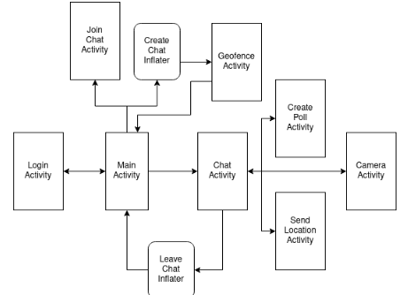

# mobile-computing-project
Project for Mobile and Ubiquitous Computing course

### ConversationalIST

Android Chat app.

## Functionalities
- Public chatrooms
- Private chatrooms. Join through invitation(link).
- Geo-fenced chatrooms. Only accessible/joinable if in a given location (coordinates and radius).

## Feautures

- Create Unique Username
- Create Unique Username
- Create/Search/Join/Leave Public Chatrooms
- Create/Share/Join/Leave Private Chatrooms
- Create/Search/Join/Leave Geo-fenced Chatrooms
- Show/Hide Geo-fenced Chatrooms When Moving
- Messages Sync Across Devices Promptly
- History Available to All Users in Chatroom
- Posting Text Messages
- Posting Photos from Camera
- Posting Locations
- Messages Indicate Author and Timestamp
- Chatrooms Indicate Unread Messages
- New Message Notifications
- Efficient Message Retrieval
- Download Images on Request with Cellular Data / Automatically with WiFi
- Data Caching
- Cache Pre-loading

## Mobile Interface Design

## Implementation

- **Programming language and platform used to implement the server:** Java, Python(Flask) and sqlite3.
- **Additional external libraries used in the project:** Google Mobile Services, flask_sockets
- **Android components (e.g., services, activities); how they communicate with each other; how they share global state:** All activities share a common variable which is the user, and communicate through intents and their extras.
- **Threads that exist in the mobile application and their function:** All communications with the server are made through AsyncTasks and everytime a message is received on the client side websocket, the client handles it, by creating a notification or displaying new messages.
- **How communications are handled:** The server (flask) and the app communicate through a rest API and websockets.
- **How state is maintained on the mobile device and server:** The state of the app is maintained because all of the data is consistent data is stored in a sqlite3 database.

